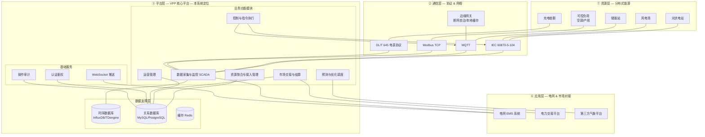
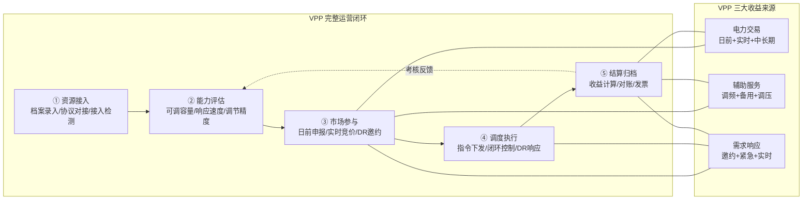
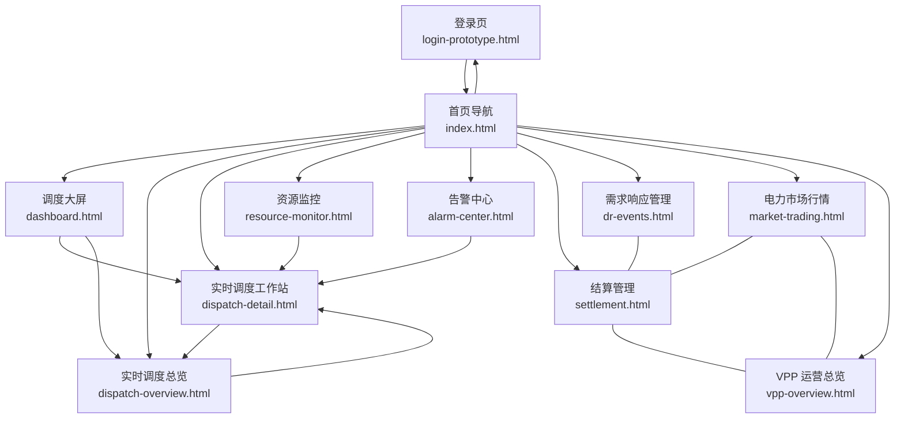
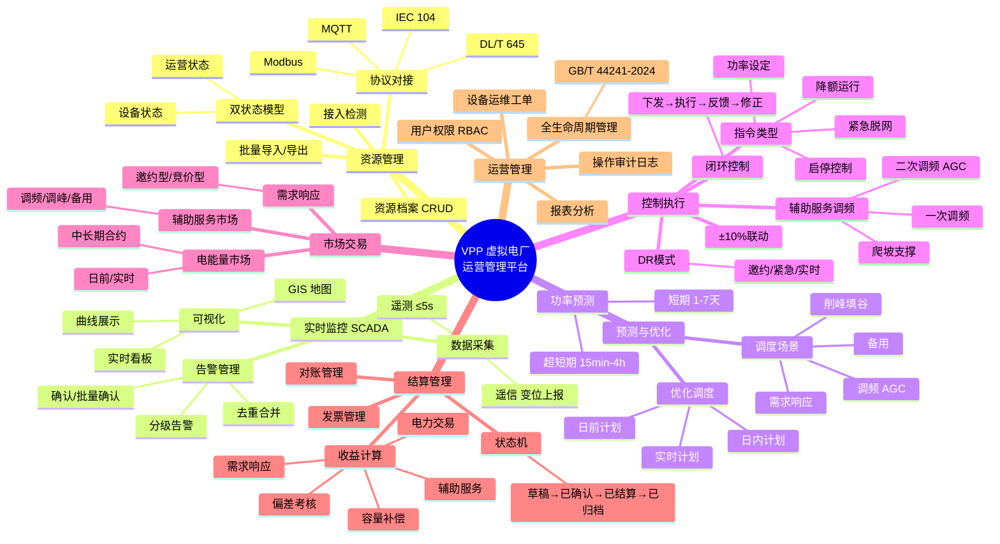
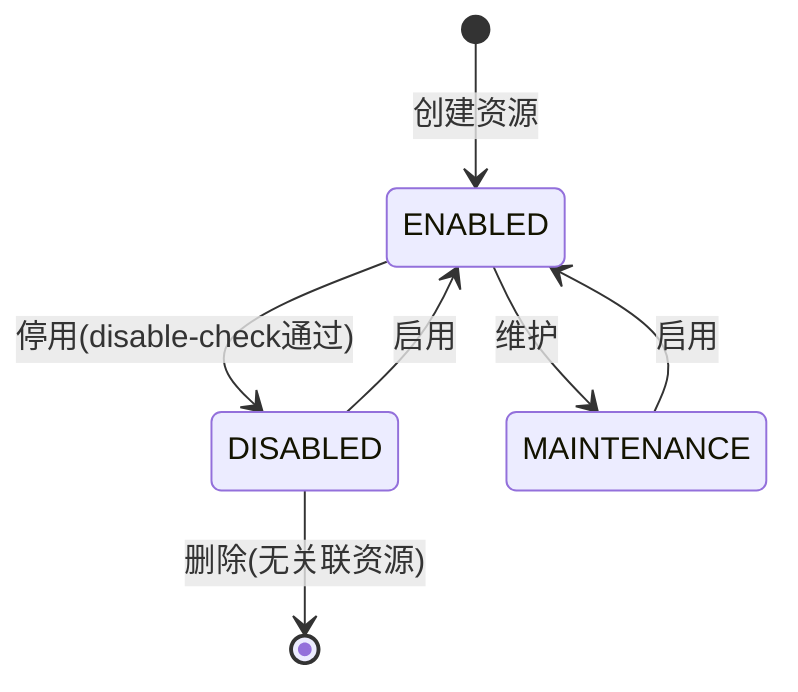
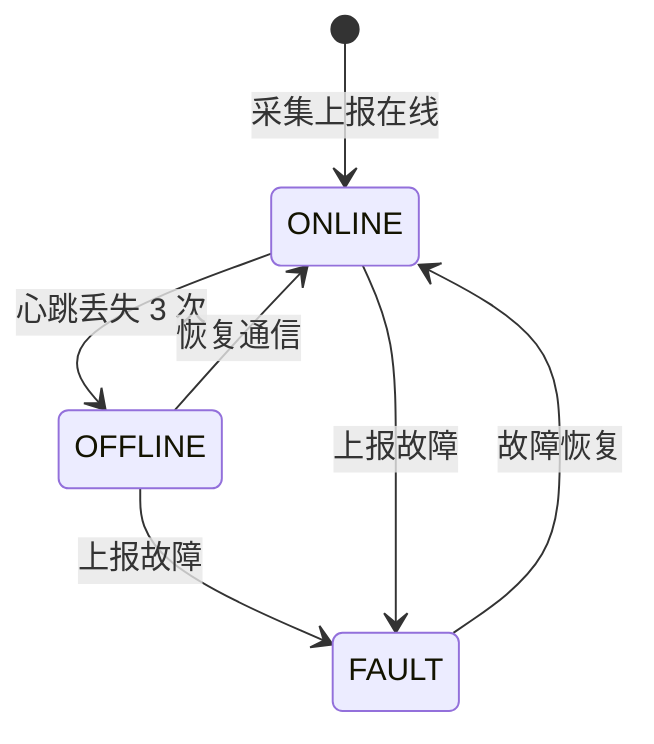
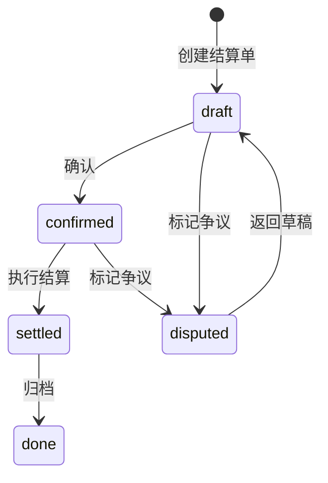
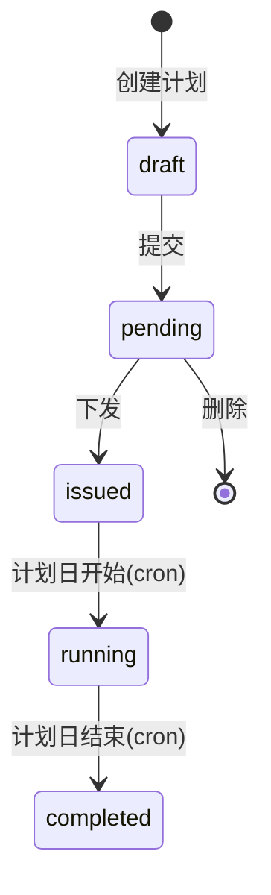
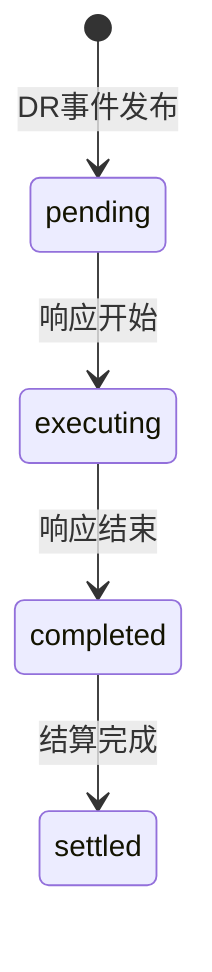
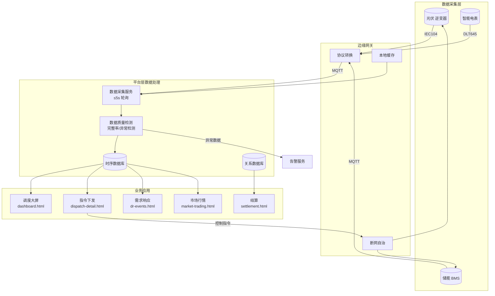

# VPP 虚拟电厂运营管理平台 — 完整设计文档

> 本文档包含：系统架构图 / 业务闭环流程图 / 页面导航流 / 状态机 / 数据流 / 项目排期

---

## 一、系统架构图



---

## 二、VPP 业务闭环流程图



| 环节 | PRD 章节 | HTML 页面 | 数据流 |
|------|----------|-----------|--------|
| ① 资源接入 | §3.1 | ❌ 缺 `resource-management.html` | 资源档案写入 RDB |
| ② 能力评估 | §3.3 | `vpp-overview.html` 雷达图 | 从 TSDB 读取历史运行数据计算 |
| ③ 市场参与 | §3.5.1 | `market-trading.html` | 从交易平台 API 获取市场价格 |
| ④ 调度执行 | §3.4 | `dispatch-detail.html` + `dr-events.html` | 指令写入 command 表 + 推送终端 |
| ⑤ 结算归档 | §3.5.2 | `settlement.html` | 从交易和调度数据自动计算 |

---

## 三、页面导航流程图



### 用户操作路径（按角色）

```
调度员:
  login → index → dashboard(看全局) → dispatch-overview(看资源状态)
       → dispatch-detail(下指令) → dr-events(处理DR事件) → settlement(看结算)

运营人员:
  login → index → vpp-overview(看运营总览) → market-trading(看市场行情)
       → settlement(看结算) → alarm-center(处理告警)

财务:
  login → index → settlement(看结算) → vpp-overview(看收益分析)

交易员:
  login → index → market-trading(看行情+报价) → settlement(看结算)
```

---

## 四、业务思维导图



---

## 五、状态机图

### 5.1 资源运营状态



### 5.2 资源设备状态



### 5.3 结算状态



### 5.4 日前调度计划状态



### 5.5 DR 事件状态



---

## 六、数据流图



### 数据流说明（按场景）

| 场景 | 数据源 | 处理后 | 目标页面 |
|------|--------|--------|----------|
| 实时监控 | 终端设备 5s 上报 | 存入 TSDB，异常触发告警 | dashboard / dispatch-overview |
| 调度指令 | 用户点击下发 | 写入 command 表 + 推送终端 | dispatch-detail |
| DR 事件 | 电网邀约/用户创建 | 基线计算 → M&V → 补贴 → 结算 | dr-events → settlement |
| 市场行情 | 交易平台 API | 价格曲线展示 | market-trading |
| 结算 | TSDB + 交易记录 | 按公式计算收益 | settlement |

---

## 七、页面交互逻辑矩阵

| 页面 | 输入操作 | 系统处理 | 输出响应 | 反馈方式 |
|------|----------|----------|----------|----------|
| login-prototype | 输入账号密码+验证码 | 校验账号/密码/验证码/锁定状态 | 登录成功→跳转 / 失败→提示 | Toast + 摇动动画 |
| login-prototype | 注册表单提交 | 校验字段唯一性+密码强度 | 注册成功→切登录Tab | Toast + Tab 切换 |
| index | 点击 KPI 卡片 | 导航到目标页 | 新窗口打开 | target=_blank |
| index | 点击导航卡片 | 导航到目标页 | 新窗口打开 | target=_blank |
| dashboard | 定时器 3s | 随机更新 KPI 数值 | 数字刷新 | 无动画 |
| dashboard | 点击地图点位 | 弹出浮层展示详情 | 浮层显示/切换/关闭 | 浮层动画 |
| dispatch-overview | 点击资源卡片 | 右侧调度摘要切换 | 摘要内容替换 | CSS transition |
| dispatch-overview | 点击 Tab | 图表类型切换 | ECharts setOption | 图表重绘 |
| dispatch-detail | 点击左侧类型 | 右侧全部内容替换 | 面板/图表/指令区刷新 | innerHTML 替换 |
| dispatch-detail | 拖动降额滑块 | 目标功率联动计算 | 数值同步更新 | input 事件 |
| dispatch-detail | 点击指令下发 | sendDispatch() → 写入历史 | Toast + 历史列表追加 | Toast 动画 |
| dr-events | 点击事件行 | M&V 面板 + 基线图表同步更新 | 数值和图切换 | 选中行高亮 |
| dr-events | 筛选类型 | 事件列表过滤 | 表格行增减 | DOM 重绘 |
| market-trading | 点击 Tab | 主图+侧栏内容切换 | ECharts setOption | 图表重绘 |
| settlement | 点击结算单行 | Modal 弹窗展示详情 | Modal 显示 | 渐入动画 |
| settlement | 点击结算 Tab | DR/辅助服务/偏差 Tab 切换 | 面板 + 图表切换 | DOM 替换 |
| alarm-center | 点击告警确认 | 状态→confirmed | 卡片样式变淡 | CSS class 切换 |
| vpp-overview | 点击闭环流程图 | 阶段高亮切换 | 已完成变绿/当前变蓝 | CSS class 切换 |

---

## 八、项目排期表

### 8.1 里程碑

| 里程碑 | 时间 | 交付物 |
|--------|------|--------|
| M1 需求冻结 | Day 1-5 | PRD V1.0 终稿 + UI 设计说明 |
| M2 设计完成 | Day 6-15 | UI 设计稿 + 系统设计文档 + 接口文档 |
| M3 核心功能开发 | Day 16-45 | 8 个核心页面 + API + 后端模块 |
| M4 新增功能开发 | Day 46-60 | 3 个新增页面(DR/市场/运营) + 改造页面 |
| M5 联调测试 | Day 61-75 | 集成测试 + 性能测试 + 安全测试 |
| M6 试运行 | Day 76-105 | 接入真实资源试运行 |
| M7 正式上线 | Day 106-110 | 部署 + 数据迁移 + 培训 |

### 8.2 详细任务分解

| 阶段 | 任务 | 工时 | 依赖 | 产出 |
|------|------|------|------|------|
| **P1 基础设施** | | **8人日** | | |
| 1.1 | 环境搭建（前后端/DB/TSDB） | 3 | — | 开发环境 |
| 1.2 | CSS 变量体系 + 粒子背景组件封装 | 2 | — | 组件库 |
| 1.3 | ECharts 图表统一配置 | 2 | — | 图表库 |
| 1.4 | WebSocket 心跳 + 消息协议 | 1 | — | WS 模块 |
| **P2 核心页面 ×8** | | **72人日** | | |
| 2.1 | login-prototype（登录+注册） | 4 | 1.1 | HTML |
| 2.2 | index（首页导航） | 2 | 1.1 | HTML |
| 2.3 | dashboard（调度大屏） | 12 | 1.2, 1.3 | HTML + 地图 |
| 2.4 | dispatch-overview（调度总览） | 10 | 1.3 | HTML |
| 2.5 | dispatch-detail（调度工作站） | 18 | 1.3, 2.4 | HTML + 4资源类型 |
| 2.6 | resource-monitor（资源监控） | 8 | 1.3 | HTML |
| 2.7 | alarm-center（告警中心） | 8 | 1.3 | HTML |
| 2.8 | settlement（结算管理） | 10 | 1.3 | HTML |
| **P3 新增页面 ×3** | | **30人日** | | |
| 3.1 | dr-events（需求响应管理） | 12 | 1.3, 2.5 | HTML + 基线/M&V |
| 3.2 | market-trading（市场行情） | 10 | 1.3 | HTML + 4Tab |
| 3.3 | vpp-overview（运营总览） | 8 | 1.3 | HTML |
| **P4 页面改造** | | **10人日** | | |
| 4.1 | dashboard 增加收益构成 | 3 | 2.3 | HTML 改造 |
| 4.2 | dispatch-detail 注入 DR/调频 | 5 | 2.5, 3.1 | HTML 改造 |
| 4.3 | settlement 增加结算明细 Tab | 2 | 2.8, 3.1 | HTML 改造 |
| **P5 后端开发** | | **40人日** | | |
| 5.1 | 资源管理 CRUD API（8 个） | 5 | 1.1 | API |
| 5.2 | SCADA 数据采集服务 | 8 | 1.1 | 微服务 |
| 5.3 | 告警管理 API（3 个） | 3 | 5.2 | API |
| 5.4 | 预测算法对接 API（2 个） | 5 | — | API |
| 5.5 | 日前调度计划 API（7 个） | 6 | 5.2 | API |
| 5.6 | 实时调度下发 API（3 个） | 5 | 5.2 | API |
| 5.7 | 结算管理 API（2 个） | 4 | 5.5 | API |
| 5.8 | 用户权限 API（3 个） | 4 | — | API |
| **P6 测试** | | **28人日** | | |
| 6.1 | 功能测试（26 条测试用例） | 12 | P2+P3 | 测试报告 |
| 6.2 | 性能测试 | 8 | P5 | 压测报告 |
| 6.3 | 安全测试（等保三级） | 8 | P5 | 安全报告 |
| **总计** | | **188人日** | | |

### 8.3 人力资源配置

| 角色 | 人数 | 主要负责 |
|------|------|----------|
| 产品经理 | 1 | 需求管理、PRD维护、验收 |
| 前端开发 | 2 | 11 个 HTML 页面开发 + 改造 |
| 后端开发 | 2 | 38 个 API + 数据采集 + 算法 |
| UI 设计 | 1 | 视觉规范、组件库 |
| 测试 | 1 | 功能 + 性能 + 安全测试 |
| 运维 | 0.5 | 部署 + CI/CD |

### 8.4 关键技术选型

| 技术栈 | 选型 | 理由 |
|--------|------|------|
| 前端图表 | ECharts 5.5.0 | 深色主题支持好，大屏可视化首选 |
| 前端框架 | 原生 JS + HTML（原型阶段） | 快速验证，无需构建工具 |
| 后端框架 | Spring Boot / Node.js | 根据团队技术栈 |
| 时序数据库 | InfluxDB 2.0 / TDengine 3.0 | 高频数据写入性能要求 |
| 关系数据库 | MySQL 8.0+ / PostgreSQL 14+ | 事务性数据存储 |
| 通信协议 | MQTT + IEC 104 | 工业标准，设备兼容性好 |
| WebSocket | WS + WSS | 实时推送 KPI/告警 |

---

*— 文档结束 · VPP 完整设计文档 —*
